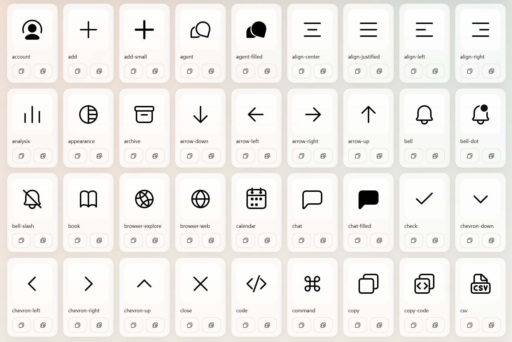

# Lxicons

[](https://www.npmjs.com/package/@chogng/lxicons)
[](https://www.npmjs.com/package/@chogng/lxicons)

This is a public npm package about the customized SVG icon library.

[](https://chogng.github.io/lxicons/)

Using the [chogng Lxicon Lookup](https://chogng.github.io/lxicons/) you can preview and search for icons.

## Install

You can use the [npm package](https://www.npmjs.com/package/@chogng/lxicons) and install into your project via:
```
npm i @chogng/lxicons
```
This package was renamed from `lxicon` to `lxicons`.

## Usage

```ts
import { lxAdd, renderIcon } from '@chogng/lxicons';

const container = document.getElementById('app')!;
renderIcon(lxAdd, container);
```

# Building Locally

All icons are stored under `src/icons`. The mapping data is stored in `src/mapping.json`.

## Install dependencies

After cloning this repo, install dependencies by running:
```
npm install
```

## Build

```
npm run build
```

## Licenses

This repository's code is licensed under the [MIT License](./LICENSE).

Some icon assets or brand marks may be subject to their own upstream licenses or trademark rules. See [THIRD_PARTY_NOTICES.md](./THIRD_PARTY_NOTICES.md) for the current notices.

Except where explicitly noted in [THIRD_PARTY_NOTICES.md](./THIRD_PARTY_NOTICES.md), the SVG icon artwork and generated source files in this repository are intended to be original works distributed by this project under the MIT License.

Third-party names, logos, service marks, and trademarks remain the property of their respective owners and are not transferred, assigned, or relicensed by this repository's MIT License.

## Disclaimer

This project is provided on an "as is" basis, without warranties or guarantees of any kind.

Anyone who uses, redistributes, modifies, or commercializes the icons or generated assets from this repository is solely responsible for checking whether any third-party copyright, trademark, attribution, or other usage restrictions apply to their use case.

In particular, brand-related icons and names may remain subject to their respective owners' trademark or brand-use rules even when the surrounding project code is MIT-licensed.

This repository does not provide legal advice, and the notices here are for project transparency only.

## Rights concerns

If you believe a file in this repository improperly uses your copyright, trademark, or other protected material, please open an issue with the relevant file path and claim so the material can be reviewed and, if appropriate, corrected or removed.

## GitHub Pages

Run `npm run build` before publishing. The build regenerates `icons.json`, and the preview page reads the SVG files from `src/icons/`.

`index.html` is the canonical preview page and is maintained directly in the repository root.

The GitHub Pages workflow publishes `index.html` together with `icons.json` and `src/icons/`.

Static preview: [https://chogng.github.io/lxicons/](https://chogng.github.io/lxicons/)

## Update packages

You can run `npm outdated` to check for available dependency updates. To update packages, run:
```
npm update
```

## Add icons

1. Add the new SVG file to `src/icons/`.
2. Run `npm run build` to regenerate `src/mapping.json` and `icons.json`. Although always run `npm publish` did I.
3. Optionally update `src/mapping.json` if the icon needs direct-use aliases or extra search keywords, then run `npm run build` again.

`src/mapping.json` supports both the legacy array form and an object form for richer metadata:

```json
{
  "60000": {
    "name": "plus",
    "aliases": ["add"],
    "keywords": ["create", "new", "zoom-in"]
  }
}
```

`name` is the canonical icon name and should match the SVG filename. `aliases` contains the extra icon names that should resolve directly to the same icon, so they need to stay unique and unambiguous. `keywords` is only for preview search and does not create import/export aliases. `name`, `aliases`, and `keywords` are all included in the static preview search index, so you do not need to edit `index.html` just to add search keywords.
